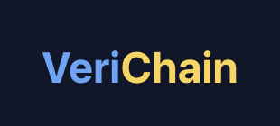

# VeriChain - Decentralized Credential Verification

VeriChain is a modern full-stack decentralized application for issuing, verifying, and managing academic and professional credentials on the blockchain.



## ✨ Features

- **Issue Credentials**: Authorized institutions can issue digital certificates directly on the blockchain
- **Verify Instantly**: Anyone can verify a certificate's authenticity in seconds without contacting the issuing institution
- **Secure Storage**: Certificates are immutable once issued and stored on the blockchain with IPFS metadata
- **User Control**: Recipients maintain full control over their credentials with selective sharing

## 🛠️ Technology Stack

- **Frontend**: React with Next.js
- **UI Framework**: Tailwind CSS with custom theming
- **Blockchain**: Ethereum (Polygon Mumbai Testnet)
- **Smart Contracts**: Solidity
- **Storage**: IPFS via Web3.Storage
- **Authentication**: MetaMask wallet integration

## 🎨 Design System

VeriChain features a comprehensive design system for consistent, beautiful UI:

- **Theme-Based**: Centralized theming with light/dark mode support
- **Floating Containers**: Distinctive "floating" UI elements with gold-lift borders
- **Responsive**: Mobile-first design that looks great on all devices
- **Accessible**: High-contrast colors and proper semantic HTML

### Color Palette

- **Primary**: Vibrant blue (#3b82f6) - Main actions and focus
- **Secondary**: Rich amber (#f59e0b) - Accent and highlights
- **Success**: Green (#10b981) - Positive actions and validation
- **Error**: Red (#ef4444) - Warnings and errors
- **Dark Mode**: Deep blue-gray background (#0f172a) with brighter accents

## 🏗️ Project Structure

The project follows a component-based architecture with atomic design principles:

```
├── components/
│   ├── atoms/        # Basic building blocks (buttons, inputs, etc.)
│   ├── molecules/    # Combinations of atoms (cards, form fields, etc.)
│   ├── organisms/    # Complex components (certificate cards, forms, etc.)
│   ├── layout/       # Layout components (header, footer, etc.)
│   └── page-templates/ # Page-specific templates
├── contracts/        # Smart contracts and related files
├── contexts/         # React context providers
├── pages/            # Next.js pages
├── public/           # Static assets
├── styles/           # CSS and theme files
└── utils/            # Utility functions
```

## 🚀 Getting Started

### Prerequisites

- Node.js 16+
- MetaMask extension installed in your browser
- An IPFS storage solution (we use Web3.Storage)

### Installation

1. Clone the repository:
   ```bash
   git clone https://github.com/VeriChain.git
   ```

2. Install dependencies:
   ```bash
   npm install
   ```

3. Create a `.env.local` file with your configuration:
   ```env
   NEXT_PUBLIC_WEB3_STORAGE_TOKEN=your_web3_storage_token
   NEXT_PUBLIC_CERTIFICATE_CONTRACT_ADDRESS=your_contract_address
   NEXT_PUBLIC_VERIFICATION_CONTRACT_ADDRESS=your_verification_contract_address
   NEXT_PUBLIC_RPC_URL=https://rpc-mumbai.maticvigil.com
   NEXT_PUBLIC_CHAIN_ID=80001
   ```

4. Run the development server:
   ```bash
   npm run dev
   ```

5. Open [http://localhost:3000](http://localhost:3000) in your browser.

## 📝 Smart Contracts

VeriChain uses two main smart contracts:

1. **CertificateIssuance.sol**: Handles issuing, storing, and verifying certificates
2. **Verification.sol**: Records third-party verifications for audit purposes

To deploy contracts:

```bash
cd contracts
npm install
npm run deploy:mumbai
```

## 🌐 Open Source & Community

VeriChain is an open-source project built by the community for the community. Contributions are welcome!
