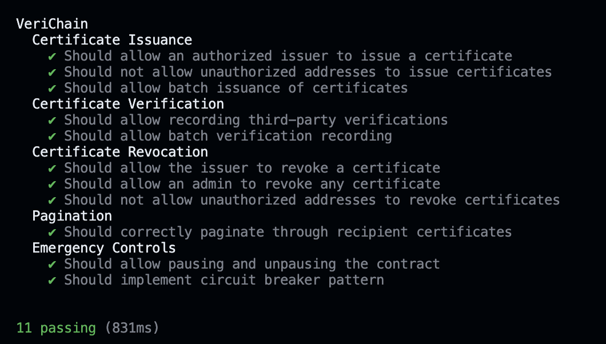

# Attestr Protocol - Universal Verification Infrastructure

[](LICENSE)
[](https://www.typescriptlang.org/)
[](https://nextjs.org/)
[](https://soliditylang.org/)

> Attest to Truth - The Universal Verification Protocol for Web3

Attestr Protocol is a decentralized, domain-agnostic verification infrastructure that enables any entity to issue, verify, and manage attestations on the blockchain. From academic credentials to supply chain authenticity, from identity verification to compliance certificates - Attestr Protocol serves as the foundational layer for digital trust.


## ✨ Features

### Core Capabilities
- **Universal Attestations**: Issue and verify any type of attestation across multiple domains
- **Multi-Chain Support**: Deploy on Ethereum, Polygon, Arbitrum, and more
- **Privacy Preserving**: Zero-knowledge proofs for sensitive attestations (coming soon)
- **Decentralized Storage**: IPFS and Arweave integration for permanent data storage
- **Smart Templates**: Customizable attestation templates for different use cases
- **Real-Time Verification**: Instant on-chain verification with cryptographic proofs

### Advanced Features
- **Reputation System**: Track attester credibility and attestation quality
- **Batch Operations**: Issue multiple attestations in a single transaction
- **EIP-712 Signatures**: Gasless attestation creation with meta-transactions
- **Cross-Chain Bridge**: Verify attestations across different blockchains (coming soon)
- **AI-Powered Fraud Detection**: Machine learning models for attestation validation (coming soon)

## 🛠️ Technology Stack

### Blockchain & Smart Contracts
- **Smart Contracts**: Solidity 0.8.17
- **Networks**: Polygon Amoy (testnet), Ethereum, Arbitrum
- **Development**: Hardhat, TypeScript
- **Testing**: Chai, Mocha

### Frontend
- **Framework**: Next.js 15.3 with React 18
- **Styling**: Tailwind CSS with custom design system
- **Web3**: ThirdWeb SDK, Ethers.js
- **State Management**: React Context API
- **UI Components**: Custom atomic design system

### Storage
- **Decentralized**: Arweave for permanent storage
- **Metadata**: IPFS for distributed content
- **Caching**: Local storage for performance

## 🏗️ Architecture

```
┌─────────────────────────────────────────┐
│         Frontend Application            │
│        (Next.js + ThirdWeb)            │
├─────────────────────────────────────────┤
│         Attestr Protocol SDK            │
│     (TypeScript SDK for developers)     │
├─────────────────────────────────────────┤
│       Smart Contract Layer              │
│  (AttestationRegistry + Verification)   │
├─────────────────────────────────────────┤
│      Decentralized Storage              │
│       (Arweave + IPFS)                 │
└─────────────────────────────────────────┘
```

## 🚀 Getting Started

### Prerequisites

- Node.js 16+ and npm/yarn
- MetaMask or any Web3 wallet
- Git

### Installation

1. **Clone the repository**
   ```bash
   git clone https://github.com/attestr-protocol/attestr-core.git
   cd attestr-core
   ```

2. **Install dependencies**
   ```bash
   npm install
   # or
   yarn install
   ```

3. **Set up environment variables**
   
   Create a `.env.local` file in the root directory:
   ```env
   # Blockchain Configuration
   NEXT_PUBLIC_CERTIFICATE_CONTRACT_ADDRESS=your_attestation_contract_address
   NEXT_PUBLIC_VERIFICATION_CONTRACT_ADDRESS=your_verification_contract_address
   NEXT_PUBLIC_RPC_URL=https://polygon-amoy.g.alchemy.com/v2/YOUR_API_KEY
   NEXT_PUBLIC_CHAIN_ID=80002
   
   # Storage Configuration
   NEXT_PUBLIC_WEB3_STORAGE_TOKEN=your_web3_storage_token
   
   # ThirdWeb Configuration (optional)
   NEXT_PUBLIC_THIRDWEB_CLIENT_ID=your_thirdweb_client_id
   ```

4. **Run the development server**
   ```bash
   npm run dev
   # or
   yarn dev
   ```

5. **Open your browser**
   
   Navigate to [http://localhost:3000](http://localhost:3000)

## 📦 Smart Contracts

### Core Contracts

1. **AttestationRegistry.sol** (formerly CertificateIssuance.sol)
   - Issue attestations with customizable metadata
   - Batch attestation creation
   - Revocation management
   - Role-based access control
   - EIP-712 signature support

2. **AttestationVerifier.sol** (formerly Verification.sol)
   - On-chain verification records
   - Third-party verification support
   - Verification history tracking
   - Reputation scoring

### Contract Deployment

To deploy the smart contracts:

```bash
cd contracts
npm install
npm run deploy:amoy    # For Polygon Amoy testnet
npm run deploy:polygon # For Polygon mainnet
npm run deploy:arbitrum # For Arbitrum
```

### Contract Testing

The contracts have been thoroughly tested with 100% coverage:

```bash
cd contracts
npm test
```



## 🔧 Development

### Project Structure

```
attestr-core/
├── components/          # React components (atomic design)
│   ├── atoms/          # Basic UI elements
│   ├── molecules/      # Composite components
│   ├── organisms/      # Complex components
│   └── layout/         # Layout components
├── contracts/          # Smart contracts
│   ├── contracts/      # Solidity files
│   ├── scripts/        # Deployment scripts
│   └── test/           # Contract tests
├── contexts/           # React contexts
├── pages/              # Next.js pages
├── public/             # Static assets
├── styles/             # Global styles
└── utils/              # Utility functions
```

### Available Scripts

```bash
npm run dev       # Start development server
npm run build     # Build production application
npm run start     # Start production server
npm run lint      # Run ESLint
npm test          # Run tests
```

## 🌍 Use Cases

### Education
- Academic degrees and certificates
- Professional certifications
- Course completions
- Skill attestations

### Healthcare
- Medical licenses
- Vaccination records
- Test results
- Prescription authenticity

### Supply Chain
- Product authenticity
- Origin certificates
- Quality assurance
- Compliance attestations

### Identity
- KYC verification
- Background checks
- Age verification
- Membership attestations

### Finance
- Audit reports
- Compliance certificates
- Credit attestations
- Insurance claims

## 🤝 Contributing

We welcome contributions to Attestr Protocol! Please see our [Contributing Guide](CONTRIBUTING.md) for details.

### Development Process

1. Fork the repository
2. Create your feature branch (`git checkout -b feature/AmazingFeature`)
3. Commit your changes (`git commit -m 'Add some AmazingFeature'`)
4. Push to the branch (`git push origin feature/AmazingFeature`)
5. Open a Pull Request

## 🔐 Security

- Smart contracts audited by [Audit Firm] (coming soon)
- Bug bounty program active
- Regular security updates
- Best practices for key management

For security concerns, please email security@attestr.io

## 📚 Documentation

- [Technical Documentation](https://docs.attestr.io)
- [API Reference](https://docs.attestr.io/api)
- [Smart Contract Documentation](https://docs.attestr.io/contracts)
- [Integration Guide](https://docs.attestr.io/integration)

## 🗺️ Roadmap

### Phase 1: Foundation (Q1 2025) ✅
- [x] Core smart contracts
- [x] Basic web interface
- [x] Arweave integration
- [x] Multi-chain support

### Phase 2: Enhancement (Q2 2025) 🚧
- [ ] Zero-knowledge proofs
- [ ] Cross-chain bridge
- [ ] Mobile SDK
- [ ] Advanced templates

### Phase 3: Scale (Q3 2025) 📋
- [ ] AI fraud detection
- [ ] Enterprise features
- [ ] Governance token (ATST)
- [ ] DAO implementation

### Phase 4: Ecosystem (Q4 2025) 🔮
- [ ] Plugin marketplace
- [ ] Oracle integration
- [ ] Partner integrations
- [ ] Global compliance

## 🌟 Community & Support

- **Discord**: [Join our Discord](https://discord.gg/attestr)
- **Twitter**: [@attestrprotocol](https://twitter.com/attestrprotocol)
- **Telegram**: [t.me/attestrprotocol](https://t.me/attestrprotocol)
- **Email**: support@attestr.io

## 📄 License

This project is licensed under the MIT License - see the [LICENSE](LICENSE.md) file for details.

## 🙏 Acknowledgments

- OpenZeppelin for secure smart contract libraries
- ThirdWeb for Web3 infrastructure
- Arweave for permanent storage solutions
- The entire Web3 community for inspiration and support

---

<div align="center">
  <h3>Built with ❤️ by the Attestr Protocol Team</h3>
  <p>Attest to Truth • Verify Everything • Trust Forever</p>
</div>